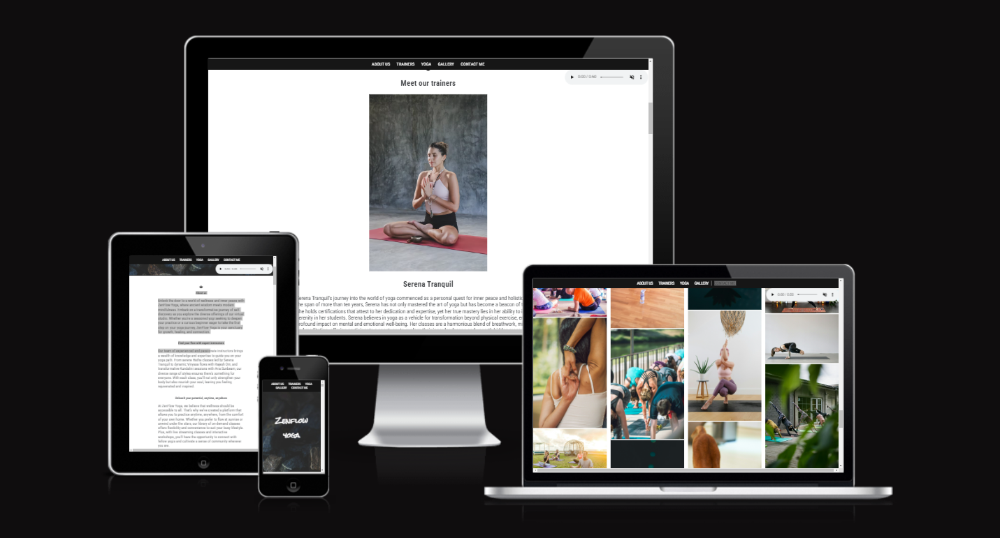
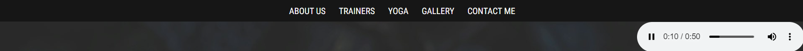
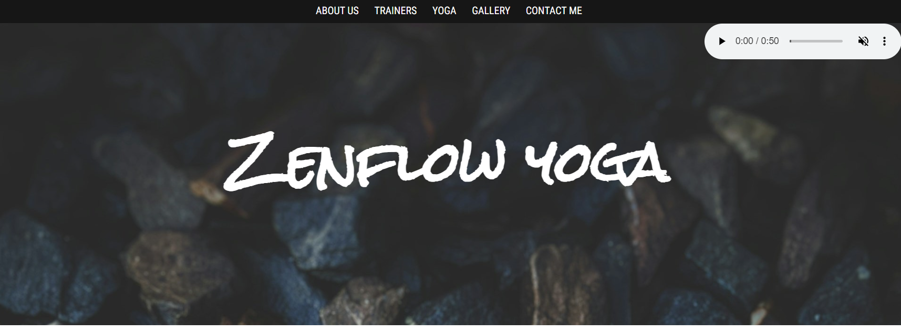
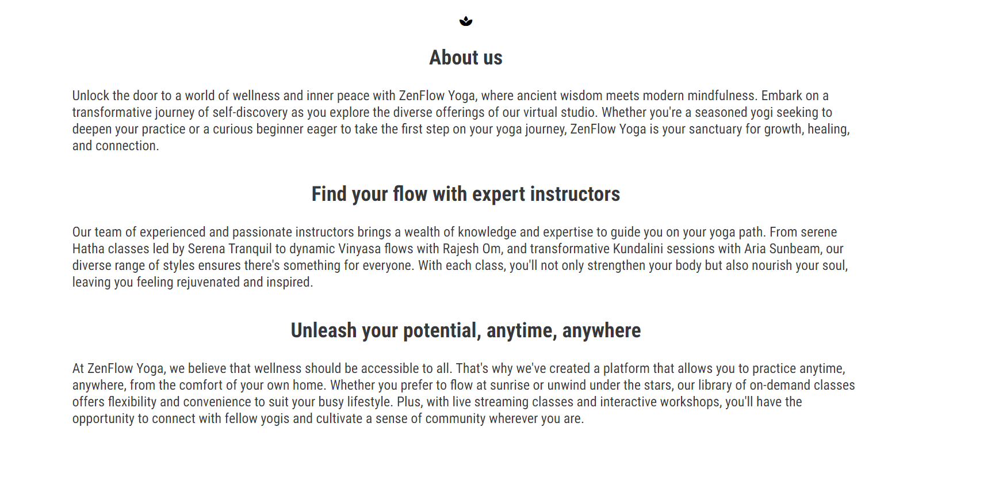
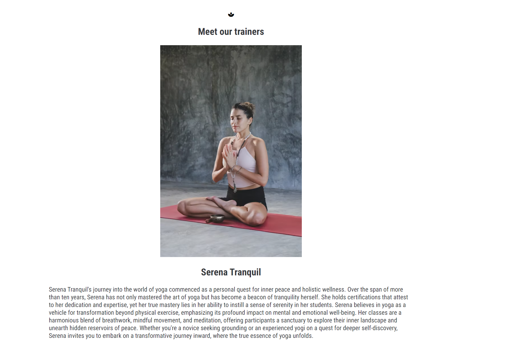
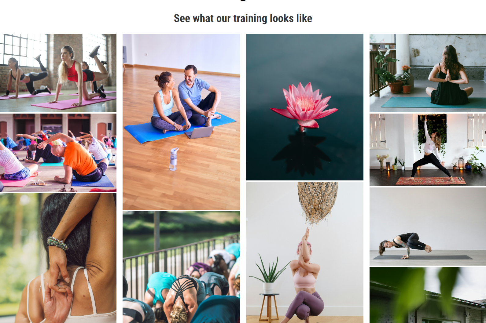
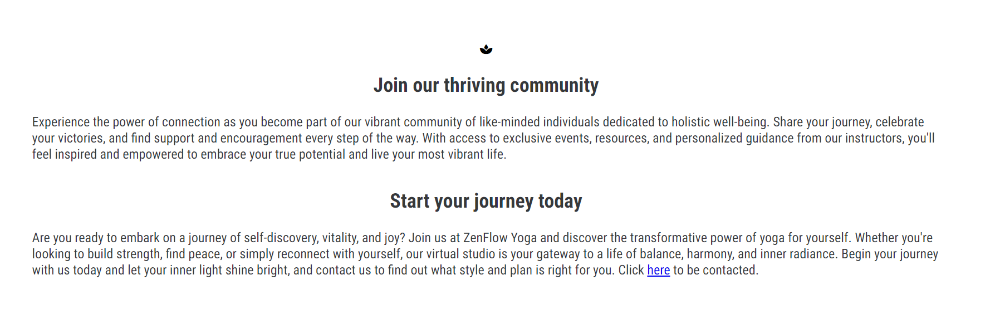
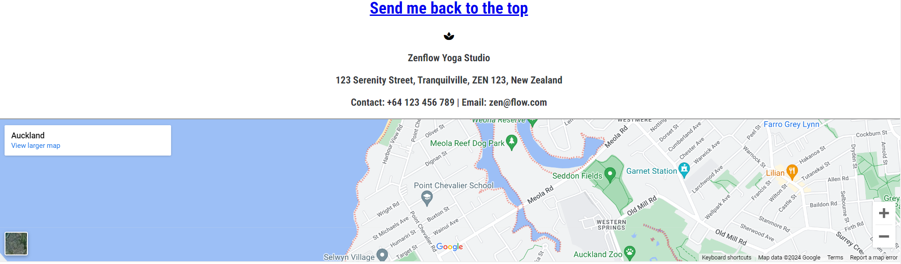
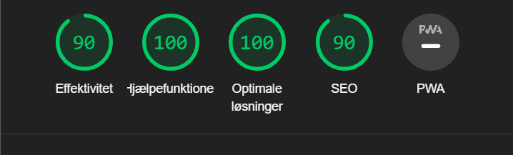

# Zenflow yoga

[Link to live project](https://andylang81.github.io/Portfolio-Project-1---HTML-CSS-Essentials/index.html)

Zenflow yoga is a testing site based on the fictive yoga club. It is target the potential clients in search of a place to practice yoga and socialize in New Zealand or online. The site is useful to see what the club is about, who they could be training with, what type of yoga they could be practicing and where to find the club.

# Features

#### Navigation bar

The site consists of two separate pages, and the navigation bar will be found on both.
On the main page, index.html, the bar will link to multiple sections on the page listing the details about the yoga club, trainers, a gallery and a call to action to contact to club. The nav bar is fixed to the top of the screen, so the user will always be able to select a new section, no matter how far they've scrolled down the page.

Attached to the nav bar is an audio player for a relaxing background of birds chirping and a slight breeze. It needs to be manually initiated and will not auto play.

### Landing page

The landing features a calm hero image with a simple text with the clubs name, setting the stage for relaxation and simplicity. 

### About us

This section details who Zenflow is, a motivational section to explain that no matter the users skill level, they might still find something relevant, 
what a user could expect from participating in the classes, and whom they'd be training with. 

### Meet the trainers

This section offers the user an introduction to the tree trainers as a continuation from the previous section, what a trainer has to offer the user, and what kind of yoga the trainer will be proficient in.

Note: To avoid excessive length, I'll only include one trainer profile in the screenshot.

### Gallery

Here the user can experience what the classes could look like as well as calming photos to lighten mood and provide a relaxing atmosphere, making the user more open to contact. It's set up in a scaling mason style layout, that'll compress to down to 2 and 1 column depending on screen size.

### Call to action

This section aims to convince the user to contact the club in order to register for classes by listing the positive outcomes of practicing yoga, as well as presenting a link to the contact page.

### Contact info and map

This section is the contact information, as well as a link to google maps for easy directions in case of a physical visit, even if it doesn't link to anything specific due to the lack of a functional API key. It also presents a user a link to send them back to the top of the page to avoid scrolling all the way back.

### Footer

This footer contains links to Facebook, Instagram, YouTube and X/Twitter

# Testing:

[W3C Markup Validator](https://validator.w3.org/) - [Results](https://validator.w3.org/nu/?doc=https%3A%2F%2Fandylang81.github.io%2FPortfolio-Project-1---HTML-CSS-Essentials%2Findex.html)

[W3C Css Validator](https://jigsaw.w3.org/css-validator/validator.html.en) - [Results](https://jigsaw.w3.org/css-validator/validator?uri=https%3A%2F%2Fandylang81.github.io%2FPortfolio-Project-1---HTML-CSS-Essentials%2Findex.html%23who&profile=css3svg&usermedium=all&warning=1&vextwarning=&lang=en)

Lighthouse score:

## Bugs

I've encountered several bugs in the process.

The main ones were the text on the hero image causing the rest of the content to shrink on smaller screen sizes. I solved it by going over each section with Chrome dev tools to find the width of each object from top to bottom, finally identifying the issue and then reworking my media queries to correctly scale the text to fit within all screen sizes.

Another bug was after using https://codebeautify.org/ to re-format the style.css, which essentially condensed it to the point of breaking by rearranging and merging rules. Ultimately, I resorted to taking my last comitted css from the working live site via my GitHub-repository and re-inserting the functional code and condensing it by hand.

## IDE

All coding has been done in CodeAnywere and committed to the GitHub-respository

## Credits:

Code:
Favicons and Social Media link icons from Fontawesome is a reuse from Code Insititutes Love Running-project.

Thanks to my mentor Rohit for good guidance. 

## Content:
Filler text for About Us, Trainers and Types of Yoga is AI generated as the project is fictive.

Text for categories, nav links, headings are written by the developer.

## Media sources
Images: https://unsplash.com/

Audio: https://freesound.org/

Icons: https://fontawesome.com, https://icons8.com/
