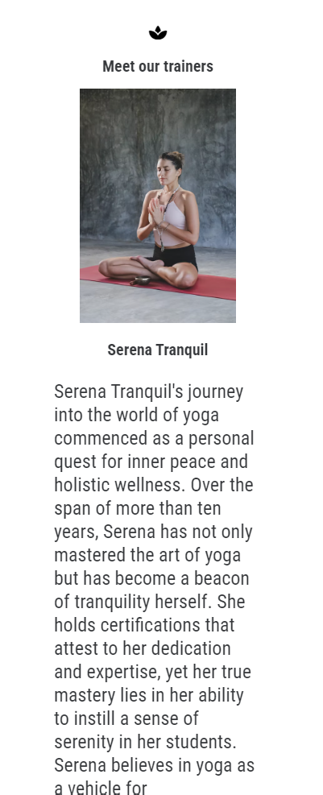

# Zenflow yoga

[Link to live project](https://andylang81.github.io/Portfolio-Project-1---HTML-CSS-Essentials/index.html)

Zenflow Yoga is a testing site based on the fictive yoga club. It is targeting the potential clients in search of a place to practice yoga and socialize in New Zealand or online. The site is useful to see what the club is about, who they could be training with, what type of yoga they could be practicing and where to find the club.

# Features

#### Navigation bar

The site consists of two separate pages, and the navigation bar will be found on both.
On the main page, index.html, the bar will link to multiple sections on the page listing the details about the yoga club, trainers, a gallery and a call to action to contact to club. The nav bar is fixed to the top of the screen, so the user will always be able to select a new section, no matter how far they've scrolled down the page.

Attached to the nav bar is an audio player for a relaxing background of birds chirping and a slight breeze. It needs to be manually initiated and will not auto play.

### Landing page

The landing features a calm hero image with a simple text with the club’s name, setting the stage for relaxation and simplicity. 

### About us

This section details who Zenflow is, a motivational section to explain that no matter the user’s skill level, they might still find something relevant, 
what a user could expect from participating in the classes, and whom they'd be training with. 

### Meet the trainers

This section offers the user an introduction to the tree trainers as a continuation from the previous section, what a trainer has to offer the user, and what kind of yoga the trainer will be proficient in.

Note: To avoid excessive length, I'll only include one trainer profile in the screenshot.

### Gallery

Here the user can experience what the classes could look like as well as calming photos to lighten mood and provide a relaxing atmosphere, making the user more open to contact. It's set up in a scaling mason style layout, that'll compress to down to 2 and 1 column depending on screen size.

### Call to action

This section aims to convince the user to contact the club to register for classes by listing the positive outcomes of practicing yoga, as well as presenting a link to the contact page.

### Contact info and map

This section is the contact information, as well as a link to google maps for easy directions in case of a physical visit, even if it doesn't link to anything specific due to the lack of a functional API key. It also presents a user a link to send them back to the top of the page to avoid scrolling all the way back.

### Footer

The footer contains links to Facebook, Instagram, YouTube and X/Twitter, so the user can find more information, inspiration and content from the club and its users.

### Contact page

The site's second page greets the user with another calming photo of a lotus flower, often associated with yoga. The aim here is to create a distraction free, relaxing background while the user can insert their contact information. The form has been created to require name and email, while phone number and the message is optional. It includes a radio button selector to indicate how the user prefers to be contacted.
At the bottom of the contact form element, the user will find the same links to social media for easy access. They are included here to avoid breaking the calming image with a footer. 
The form has been given a slight background to raise it from the picture.

### Contact page nav bar

The navbar has been repeated on the contact page, but with the link to the current page removed for simplicity. Here the user can navigate back to the other sections of the index.html page. 

### Alternative ideas to implement

It could be beneficial to users with a library of video segments on different exercises and yoga styles.

# Testing:

The site has been simulated via Chromes Devtools on Galaxy Z Fold 5, iPad Pro and responsive setting through all breakpoints listed in the media queries. Tested in Chrome, Firefox, Edge, Brave.

### Manual testing:

On the landing page, user will see the Navigation bar with the links 

Clicking on the link "About us" will lead the user to the section describing Zenflow and their mission, found on the main page.

Clicking the link "Trainers" will lead the user to an introduction to the three different trainers, found on the main page. They do not have a link each.

Clicking the link "Yoga" will lead the user to an introduction to the three different types of yoga practiced at the studio, found on the main page.

Clicking the link "Gallery" will lead the user to the image gallery, found on the main page.

Clicking the link "Contact me" will lead the user to the separate page with a contact form.

### Contact form testing:

User clicking submit without entering a name will result in an error requiring a name to be entered.

User clicking submit without entering an email address will result in an error requiring a valid email containing an @ to be entered.

User clicking submit with these two filts filled, the from will validate and return the following info.

### Validation

[W3C Markup Validator](https://validator.w3.org/) - [Results](https://validator.w3.org/nu/?doc=https%3A%2F%2Fandylang81.github.io%2FPortfolio-Project-1---HTML-CSS-Essentials%2Findex.html)

[W3C Css Validator](https://jigsaw.w3.org/css-validator/validator.html.en) - [Results](https://jigsaw.w3.org/css-validator/validator?uri=https%3A%2F%2Fandylang81.github.io%2FPortfolio-Project-1---HTML-CSS-Essentials%2Findex.html%23who&profile=css3svg&usermedium=all&warning=1&vextwarning=&lang=en)

Lighthouse score:

## Deployment

The site is deployed with GitHub. 

A link to the repository can be found [here](https://github.com/AndyLang81/Portfolio-Project-1---HTML-CSS-Essentials) 

The live page can be found by going to the top bar and selecting Settings > Pages > GitHub Pages.

Steps to deploy: Upon opening the dashboard, user should see their active repositories on the profile.

Upon selecting the repository in question (Portfolio-Project-1), user should see the bar with general options in the top portion of the screen. 

User should click on "Settings" which opens the General page with a column of options on the left hand side.

Here, user should click on "Pages", which will open the page "GitHub Pages" and find the section in the main screen labelled "Build and deployment."

After ensuring main and /root are selected and clicking "Save" user will see their deployed pages in the section above labelled "GitHub Pages."

Clicking the link in the box will lead the user to the live site.

## Bugs

I've encountered several bugs in the process.

The main ones were the text on the hero image causing the rest of the content to shrink on smaller screen sizes. I solved it by going over each section with Chrome dev tools to find the width of each object from top to bottom, finally identifying the issue and then reworking my media queries to correctly scale the text to fit within all screen sizes.

Another bug was after using https://codebeautify.org/ to re-format the style.css, which essentially condensed it to the point of breaking by rearranging and merging rules. Ultimately, I resorted to taking my last committed css from the working live site via my GitHub-repository and re-inserting the functional code and condensing it by hand.

One issue I cannot get rid of is that the frameborder on the iframe causes (border x2 px) horizontal scroll, but if I don't remove it, the validator is causing issues, and it doesn't seem to work in the css.

## IDE

All coding has been done in CodeAnywere and committed to the GitHub-repository.

## Credits:

Code:
Favicons and Social Media link icons from Fontawesome is a reuse from Code Institute’s Love Running project.

Contact page: The idea to the contact page, although it has different content, layout and picture, is reused from Code Institute’s Love Running project.

Thanks to my mentor Rohit for good guidance. 

All skills are acquired by Code Institutes HTML basics.

## Content:
Filler text for About Us, Trainers and Types of Yoga is AI generated as the project is fictive.

Text for categories, nav links, headings are written by the developer.

## Media sources
Images: https://unsplash.com/

Audio: https://freesound.org/

Icons: https://fontawesome.com, https://icons8.com/

